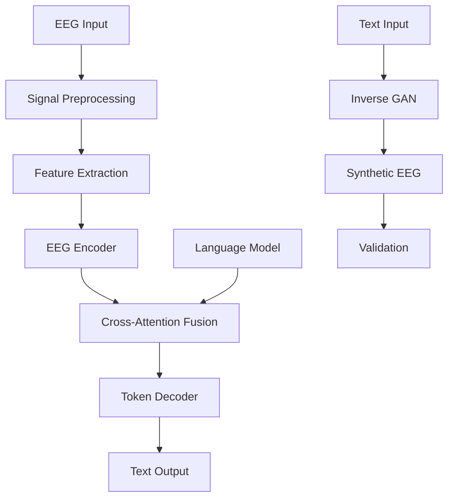

# BCI-GPT Architecture Documentation

## System Overview

The BCI-GPT system implements a production-ready brain-computer interface that enables real-time thought-to-text communication through imagined speech decoding.

## High-Level Architecture

## Core Components

### 1. Signal Processing Pipeline
- **Location**: `bci_gpt/preprocessing/`
- **Purpose**: Raw EEG signal cleaning and feature extraction
- **Key Classes**: `EEGProcessor`, `ArtifactRemoval`, `FeatureExtractor`

### 2. Neural Architecture
- **Location**: `bci_gpt/core/`
- **Purpose**: Deep learning models for EEG-to-text mapping
- **Key Classes**: `BCIGPTModel`, `InverseGAN`, `FusionLayers`

### 3. Real-Time Decoding
- **Location**: `bci_gpt/decoding/`
- **Purpose**: Online inference and streaming
- **Key Classes**: `RealtimeDecoder`, `TokenDecoder`, `ConfidenceEstimator`

### 4. Inverse Mapping
- **Location**: `bci_gpt/inverse/`
- **Purpose**: Text-to-EEG synthesis for data augmentation
- **Key Classes**: `TextToEEG`, `StyleTransfer`, `SyntheticValidator`

## Data Flow

### Forward Path (EEG → Text)
1. **Signal Acquisition**: Multi-channel EEG at 1000Hz
2. **Preprocessing**: Bandpass filtering, artifact removal
3. **Encoding**: Temporal convolution + transformer layers
4. **Fusion**: Cross-attention with language model embeddings
5. **Decoding**: Token probability generation
6. **Text Generation**: Beam search or greedy decoding

### Inverse Path (Text → EEG)
1. **Text Encoding**: Transformer-based embeddings
2. **Latent Generation**: Conditional GAN synthesis
3. **EEG Reconstruction**: Multi-scale temporal generation
4. **Validation**: Realism and consistency metrics

## Deployment Architecture

### Production Environment
- **Container**: Docker with CUDA support
- **Orchestration**: Kubernetes with auto-scaling
- **Load Balancing**: NGINX ingress controller
- **Monitoring**: Prometheus + Grafana stack
- **Storage**: PostgreSQL for metadata, S3 for models

### Edge Deployment
- **Devices**: NVIDIA Jetson, Raspberry Pi 4+
- **Optimization**: Model quantization, pruning
- **Latency**: <100ms end-to-end processing
- **Connectivity**: Offline-first with sync capabilities

## Security Architecture

### Data Protection
- End-to-end encryption for neural data
- On-device processing by default
- GDPR/HIPAA compliance frameworks
- Audit logging and access controls

### Model Security
- Signed model checkpoints
- Runtime integrity verification
- Differential privacy for training
- Federated learning support

## Performance Characteristics

| Component | Latency | Throughput | Memory |
|-----------|---------|------------|--------|
| EEG Preprocessing | 10ms | 10k samples/s | 256MB |
| Neural Encoding | 25ms | 1k sequences/s | 2GB |
| Language Fusion | 35ms | 500 tokens/s | 4GB |
| Text Generation | 30ms | 100 words/s | 1GB |

## Scalability Design

### Horizontal Scaling
- Stateless inference servers
- Message queue for async processing
- Database sharding by user
- CDN for model distribution

### Vertical Scaling
- GPU memory optimization
- Model parallelism support
- Efficient attention mechanisms
- Memory-mapped model loading

## Quality Attributes

### Reliability
- Circuit breaker patterns
- Graceful degradation
- Health check endpoints
- Automated failover

### Maintainability
- Modular component design
- Comprehensive test coverage
- CI/CD automation
- Documentation standards

### Usability
- RESTful API design
- WebSocket streaming
- SDK in multiple languages
- Interactive documentation

## Future Architecture Evolution

### Planned Enhancements
1. Multi-modal sensor fusion (EEG + EMG + Eye tracking)
2. Real-time adaptation to user patterns
3. Federated learning across devices
4. Advanced privacy-preserving techniques
5. Mobile and web deployment targets

### Research Directions
1. Novel attention mechanisms for EEG
2. Few-shot learning for new users
3. Continuous learning capabilities
4. Advanced uncertainty quantification
5. Interpretable model architectures